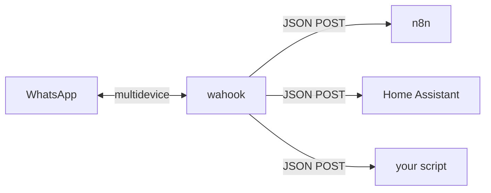

# wahook

A small self-hosted daemon that forwards your **personal WhatsApp** messages to HTTP webhooks. Built on [whatsmeow](https://github.com/tulir/whatsmeow), runs as a single Docker container, no database server, no CGO.

Pair once by scanning a QR code, then every incoming message is POSTed as JSON to whatever endpoints you configure — n8n, Home Assistant, a Discord relay, a custom script, anything that speaks HTTP.



## How it works

1. You pair it with your WhatsApp account (scan a QR code, once). The session is stored in a sqlite file.
2. It stays connected to WhatsApp's multidevice servers (like a linked phone).
3. Each incoming message is mapped to a JSON payload and forwarded to every webhook whose filter matches, over HTTP POST, with retries and a per-endpoint queue.

It is **read-only / forward-only** in the MVP — it does not send replies back to WhatsApp.

## Quickstart (Docker) — recommended

### Prerequisites

- Docker with the compose plugin

### Steps

```bash
git clone <this-repo> wahook && cd wahook

# 1. Create your config (the webhook URL is the only thing you must set)
cp config.example.yaml config.yaml
$EDITOR config.yaml     # set at least one webhook url; keep device.store: /data/wa.db

# 2. Build the image
docker compose build

# 3. Pair once (interactive — a QR code renders in your terminal)
docker compose run --rm wahook
#   → open WhatsApp on your phone → Settings → Linked Devices → Link a Device → scan

# 4. Run it as a background daemon
docker compose up -d
docker compose logs -f
```

That's it. The container auto-restarts on crash and comes back on host boot (`restart: unless-stopped`). The session lives in the `wahook-data` volume, so rebuilding the image or restarting the host does not log you out.

> **Pairing note:** the QR code only appears in an interactive terminal, which is why step 3 uses `docker compose run` (attached) instead of `up -d`. You only do this once. If WhatsApp ever logs the device out (e.g. you remove it from Linked Devices), wahook exits with a clear log line — just run step 3 again to re-pair.

## Configuration

Config is a single YAML file (`config.yaml`, bind-mounted into the container). Example:

```yaml
device:
  store: /data/wa.db          # sqlite session path. In Docker, MUST be /data/wa.db

webhooks:                     # at least 1 required
  - name: n8n                 # required, unique (shows up in logs)
    url: https://n8n.local/webhook/wa   # required
    headers:                  # optional
      Authorization: Bearer secret
    timeout: 10s              # optional, default 10s
    retry: 2                  # optional, retries after the first attempt, default 2
    filters:                  # all optional; default = accept everything
      groups_only: false
      dm_only: false
      ignore_from_me: false
      ignore_broadcast: true
      senders: []
      keyword_prefix: ""

  - name: log-all
    url: http://localhost:9000/wa
    # no filters → receives every message
```

### Field reference

| Field | Description |
| --- | --- |
| `device.store` | Path to the sqlite session file. `./wa.db` for the binary, `/data/wa.db` in Docker. |
| `media.download` | `false` by default. When `true`, media files (image/video/audio/document/sticker) are downloaded and base64-encoded into `payload.media.data`. |
| `media.max_bytes` | Skip files larger than this when downloading. Default `10485760` (10MB). Skipped files get an `error` note in `media`. |
| `webhooks[].name` | Unique label for logs. |
| `webhooks[].url` | HTTP(S) endpoint to POST to. |
| `webhooks[].headers` | Static headers added to every POST (e.g. auth). |
| `webhooks[].timeout` | Per-request HTTP timeout. Default `10s`. |
| `webhooks[].retry` | Retries after the first attempt fails. Default `2`. |
| `webhooks[].filters` | See filters below. Omit to accept everything. |

### Filters

All filters are ANDed. A message that fails the filter for one webhook is still delivered to the others.

| Filter | Default | Description |
| --- | --- | --- |
| `groups_only` | `false` | Only group messages. |
| `dm_only` | `false` | Only direct messages. Mutually exclusive with `groups_only`. |
| `ignore_from_me` | `false` | Skip messages sent by your own account (from another linked device). |
| `ignore_broadcast` | `true` | Skip status / broadcast messages. |
| `senders` | `[]` | Whitelist of sender JIDs (e.g. `62812xxx@s.whatsapp.net`). Empty = all. |
| `keyword_prefix` | `""` | Only text messages starting with this prefix (e.g. `"!cmd"`). Non-text always fails this filter. |

## Webhook payload

Each matching message produces one `POST` per webhook. `Content-Type: application/json`.

```json
{
  "id": "3EB0XXXX",
  "chat": "62812xxx@s.whatsapp.net",
  "sender": "62812xxx@s.whatsapp.net",
  "sender_alt": "",
  "push_name": "Utsman",
  "is_group": false,
  "is_from_me": false,
  "timestamp": "2026-07-17T12:34:56+07:00",
  "type": "text",
  "text": "hello world",
  "media": null
}
```

| Field | Description |
| --- | --- |
| `id` | WhatsApp message ID. |
| `chat` | Chat JID. Groups end in `@g.us`. |
| `sender` | Sender JID. |
| `sender_alt` | LID-addressed sender, when present. |
| `push_name` | Sender display name. |
| `is_group` | `true` for group messages. |
| `is_from_me` | `true` if sent by your own account. |
| `timestamp` | RFC3339. |
| `type` | One of: `text`, `image`, `video`, `audio`, `document`, `sticker`, `location`, `contact`, `reaction`, `unknown`. |
| `text` | Body text, caption, or display name (depending on `type`). |
| `media` | Media metadata object, or `null`. When `media.download` is enabled in config, includes a base64 `data` field with the file content. |

A successful delivery is any `2xx` response. Anything else or a network error triggers an exponential-backoff retry (`1s → 2s → 4s …`, capped at 30s).

Only real user content is forwarded — receipts, typing indicators and protocol messages are dropped before dispatching, and duplicate deliveries of the same message ID are deduplicated.

## Deploying to a server

The image is published to GHCR by the release workflow. On the server:

```bash
mkdir wahook && cd wahook
# drop in a docker-compose.yml that references the published image + your config.yaml:
#   services:
#     wahook:
#       image: ghcr.io/<owner>/wahook:vX.Y.Z   # or :latest
#       restart: unless-stopped
#       volumes:
#         - ./config.yaml:/config/config.yaml:ro
#         - wahook-data:/data
#       environment:
#         TZ: Asia/Jakarta
#   volumes:
#     wahook-data:
docker compose run --rm wahook   # pair once
docker compose up -d
```

Releases are created manually from the **Actions → deploy → Run workflow** tab in GitHub, choosing a `major` / `minor` / `patch` bump. The workflow tags `vX.Y.Z`, builds a multi-arch image (`linux/amd64` + `linux/arm64`), pushes it to GHCR, and opens a GitHub Release.

## Running as a binary (no Docker)

```bash
go build -o wahook .
cp config.example.yaml config.yaml   # device.store: ./wa.db
./wahook -config config.yaml         # scan the QR in the terminal
```

## Development

```bash
go test ./...        # config validation, filter semantics, webhook delivery/retry
go build -o wahook .
```

Project layout:

```
main.go                     # entrypoint + wiring
internal/config/            # yaml load, defaults, validation
internal/whatsapp/          # whatsmeow client: session store, QR pairing, events
internal/payload/           # events.Message → JSON mapping
internal/webhook/           # per-endpoint worker: filter → queue → POST + retry
config.example.yaml         # annotated example config
Dockerfile                  # multi-stage: golang build → UPX → scratch (~10MB)
docker-compose.yml
.github/workflows/deploy.yml # manual semver release workflow
```

## Caveats

- WhatsApp multidevice is unofficial; accounts can occasionally be flagged. Use with your own personal account, not for spam or high-volume automation.
- Media files are not downloaded or forwarded in the MVP — only metadata is sent.
- No outbound replies — wahook only listens and forwards.
