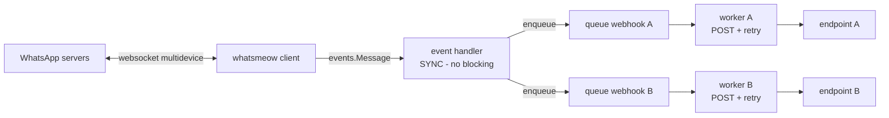

# TECHDOC.md — wahook

Technical reference for `wahook`. Source of truth for architecture, schemas and technical decisions. When the implementation changes, this document must change with it.

## 1. Overview

A small Go CLI daemon that:

1. Logs in to a personal WhatsApp account via multidevice (QR pairing, whatsmeow).
2. Persists the session in sqlite → subsequent runs auto-login, no QR.
3. Listens for `events.Message` from whatsmeow.
4. Maps each message to a JSON payload.
5. Forwards the payload **asynchronously** to every webhook that passes the filter, via HTTP POST.



## 2. Stack & rationale

| Component | Choice | Reason |
| --- | --- | --- |
| WA client | `go.mau.fi/whatsmeow` | Multidevice API, actively maintained |
| Session store | `whatsmeow/store/sqlstore` + `modernc.org/sqlite` | Pure-Go sqlite driver → `CGO_ENABLED=0`, standalone binary, easy cross-compile |
| Config | `gopkg.in/yaml.v3` | De-facto standard |
| QR terminal | `mdp/qrterminal/v3` | Used by the official whatsmeow example (mdtest) |
| HTTP client | `net/http` stdlib | Sufficient |
| Logging | `log/slog` stdlib | Structured, no dependency |

Important note: `sqlstore.New` uses driver name `"sqlite"` (modernc), **not** `"sqlite3"` (mattn, CGO). The DSN uses modernc pragmas: `file:wa.db?_pragma=foreign_keys(1)&_pragma=busy_timeout(5000)` — `foreign_keys` is required; without it sqlstore fails with `foreign keys are not enabled`.

## 3. Login & session flow

1. `sqlstore.New(ctx, "sqlite", dsn, logger)` → `container.GetFirstDevice(ctx)`.
2. `whatsmeow.NewClient(deviceStore, logger)`.
3. If `client.Store.ID == nil` (not logged in):
   - `qrChan, _ := client.GetQRChannel(ctx)` — **must be called BEFORE `Connect()`**.
   - `client.Connect()` in a goroutine.
   - Loop over `qrChan`: `"code"` event → render with `qrterminal.GenerateHalfBlock(code, qrterminal.L, os.Stdout)`; `"success"` → continue; `"timeout"` → error.
4. If already logged in: call `client.Connect()` directly.
5. Graceful shutdown: SIGINT/SIGTERM → `client.Disconnect()`.

Client flags used (from the official docs):

- `client.EnableAutoReconnect = true` — auto-reconnect when the connection drops.
- `client.AutoTrustIdentity = true` — long-running daemon; do not stall on the trust prompt.

## 4. Event handling — critical gotcha

- `client.AddEventHandler(fn)` — `fn` is invoked **synchronously** on the whatsmeow goroutine, before the ACK is sent to the WA server.
- Because of this, the handler may **only** map the payload and enqueue it (non-blocking). All HTTP POSTs happen in separate workers.
- If the queue is full: the message is dropped for that webhook + `slog.Warn` (no backpressure into the handler).
- Handled event: `*events.Message`. Others (`Connected`, `LoggedOut`, `ConnectFailure`, receipts) are only logged.
- `events.LoggedOut` → logged as fatal-ish, exit non-zero (so a supervisor restarts and it's obvious re-pairing is required).

## 5. Config schema (`config.yaml`)

```yaml
device:
  store: ./wa.db          # sqlite session path. default: ./wa.db

webhooks:                 # at least 1 required
  - name: n8n             # required, unique (used in logs)
    url: https://n8n.local/webhook/wa   # required
    headers:              # optional, map string→string
      Authorization: Bearer xxx
    timeout: 10s          # optional, Go duration. default: 10s
    retry: 2              # optional, retries after the first attempt fails. default: 2
    filters:              # all optional; default = accept everything
      groups_only: false  # only group messages
      dm_only: false      # only direct messages (mutually exclusive with groups_only)
      ignore_from_me: false  # skip messages sent by your own account (from another device)
      ignore_broadcast: true # skip status/broadcast. default: true
      senders: []         # whitelist sender JIDs (e.g. 628xxx@s.whatsapp.net). empty = all
      keyword_prefix: ""  # only text messages starting with this prefix (e.g. "!cmd")
```

Validation at startup (fatal on failure):

- `webhooks` must have at least 1 entry.
- `name` is unique, `url` is a valid http(s) URL.
- `groups_only` and `dm_only` must not both be true.

## 6. Payload schema (JSON POST body)

Content-Type: `application/json`. One POST per message per webhook.

```json
{
  "id": "3EB0XXXX",
  "chat": "62812xxx@s.whatsapp.net",
  "sender": "62812xxx@s.whatsapp.net",
  "sender_alt": "",
  "push_name": "Utsman",
  "is_group": false,
  "is_from_me": false,
  "timestamp": "2026-07-17T12:34:56+07:00",
  "type": "text",
  "text": "halo dunia",
  "media": null
}
```

Fields:

| Field | Source (whatsmeow) | Notes |
| --- | --- | --- |
| `id` | `Info.ID` | |
| `chat` | `Info.Chat.String()` | JID of the chat; groups = `...@g.us` |
| `sender` | `Info.Sender.String()` | |
| `sender_alt` | `Info.SenderAlt.String()` | LID addressing; empty when absent |
| `push_name` | `Info.PushName` | |
| `is_group` | `Info.IsGroup` | |
| `is_from_me` | `Info.IsFromMe` | |
| `timestamp` | `Info.Timestamp` | RFC3339 |
| `type` | detected from the protobuf message | see table below |
| `text` | `GetConversation()` / `GetExtendedTextMessage().GetText()` / caption | primary text of the message |
| `media` | media metadata | `null` for non-media. **Media files are NOT downloaded in the MVP** |

`type` detection (check order on `v.Message`):

| `type` | protobuf getter | `text` filled from |
| --- | --- | --- |
| `text` | `GetConversation()` / `GetExtendedTextMessage()` | body text |
| `image` | `GetImageMessage()` | caption |
| `video` | `GetVideoMessage()` | caption |
| `audio` | `GetAudioMessage()` | — |
| `document` | `GetDocumentMessage()` | caption |
| `sticker` | `GetStickerMessage()` | — |
| `location` | `GetLocationMessage()` | name/address |
| `contact` | `GetContactMessage()` | display name |
| `reaction` | `GetReactionMessage()` | emoji |
| `unknown` | fallback | — |

`media` object (when present): `mime_type`, `file_name` (document), `file_length`, `width`/`height` (image/video), `caption`, `seconds` (audio/video), `ptt` (voice note).

## 7. Filter semantics

- All filters within a webhook are ANDed.
- `senders` matches `Info.Sender.String()` exactly.
- `keyword_prefix` applies only to payloads of `type: text`; non-text messages always fail this filter.
- A message that fails the filter for one webhook is not enqueued to that webhook, but is still processed by the others.

## 8. Delivery semantics

- One **worker goroutine per webhook**, buffered channel capacity 100.
- Enqueue is non-blocking; when full → drop + warn log.
- POST with `http.Client{Timeout: timeout}`.
- Success = 2xx status. Anything else or a network error → retry.
- Retry: exponential backoff 1s → 2s → 4s … (no jitter in the MVP, cap 30s). Total attempts = 1 + `retry`.
- All attempts failed → `slog.Error` + move on (at-most-once best-effort; no dead-letter in the MVP).
- Shutdown: stop enqueueing, drain the queues with a 5s deadline, then exit.

## 9. Logging

- `log/slog`, info level by default, text format to stderr.
- Log lines: startup (config loaded, N webhooks active), QR events, connected, message forwarded (webhook, msg id, latency), failures (attempt, error).
- Do not log the full message `text` at info level (privacy); log only `id`, `chat`, `type`, text length. Full text only at debug level.

## 10. Deployment (Docker)

The official deployment is a Docker container via docker compose. Backgrounding/autostart is delegated to the Docker engine (`restart: unless-stopped`); identical on macOS and Ubuntu/server Linux — no launchd/systemd.

- **Image**: multi-stage — `golang:1.26-bookworm` build (`CGO_ENABLED=0 -ldflags="-s -w" -trimpath`), compressed with **UPX** (`--best --lzma`), final image **`scratch`** (just the binary + `ca-certificates.crt`). Size ~10MB. `tzdata` is embedded into the binary via `import _ "time/tzdata"` because scratch has no zoneinfo. Trade-off: no shell in the image (no `docker exec` debugging) and slightly slower startup (UPX decompression) — acceptable for a daemon that starts once.
- **Volume**: named volume `wahook-data` at `/data` — the sqlite session persists across recreates. `config.yaml` is bind-mounted read-only to `/config/config.yaml`.
- **Config in container**: `device.store` MUST be `/data/wa.db` (not `./wa.db`).
- **First pairing**: `docker compose run --rm wahook` (interactive TTY, QR is shown) → scan → session lands in the volume → `docker compose up -d`.
- **Graceful stop**: `docker stop` sends SIGTERM → the signal handler drains the queues (5s) → `Disconnect()`. The default `stop_grace_period` of 10s is enough.
- **Crash/logout**: non-zero exit + `restart: unless-stopped` → the container auto-restarts. The `LoggedOut` case still requires manual re-pairing (session invalid).
- **Arch**: the image is built per host (`docker compose build`). To deploy cross-architecture (mac arm64 → amd64 server): build on the target, or `docker buildx build --platform linux/amd64`.

Commands:

```bash
docker compose build
docker compose run --rm wahook   # pair once
docker compose up -d             # daemon
docker compose logs -f
```

## 11. Release (GitHub Actions)

Workflow `.github/workflows/deploy.yml` — **manual trigger** (`workflow_dispatch`) with input `bump` = `major|minor|patch` (default `patch`). One run:

1. **Compute the next version** from the highest semver git tag (`git tag -l 'v*' | sort -V | tail -1`, default `v0.0.0`). Do NOT use `git describe` — it returns the nearest reachable tag from HEAD, not the highest version.
2. **Create and push** the git tag `vX.Y.Z` (annotated, by github-actions[bot]). Fails clearly if the tag already exists.
3. **Build and push** the multi-arch image (`linux/amd64,linux/arm64`) to GHCR `ghcr.io/<owner>/wahook`. Cross-compiled via `TARGETOS/TARGETARCH` buildx args (build & compress stages use `--platform=$BUILDPLATFORM`, so no QEMU is needed for compilation; UPX compresses both arches in a single stage). Cache: `type=gha`.
4. Image tags: `:vX.Y.Z`, `:X.Y`, `:X`, `:latest`.
5. A **GitHub Release** is created with `--generate-notes`.

Workflow permissions: `contents: write` (tag + release), `packages: write` (GHCR). GHCR auth uses the built-in `GITHUB_TOKEN` — no extra secrets.

To deploy on a server from the registry (without building): replace `build: .` in compose with `image: ghcr.io/<owner>/wahook:vX.Y.Z`, then `docker compose pull && up -d`.

## 12. Out of scope / roadmap

- Download and forward media files (base64 or multipart).
- Outbound messaging (HTTP API, reverse direction).
- Health/status HTTP endpoint.
- Dead-letter queue + redrive.
- Jitter backoff, metrics.
- Non-root user in the image (currently scratch + root for volume-permission simplicity).
